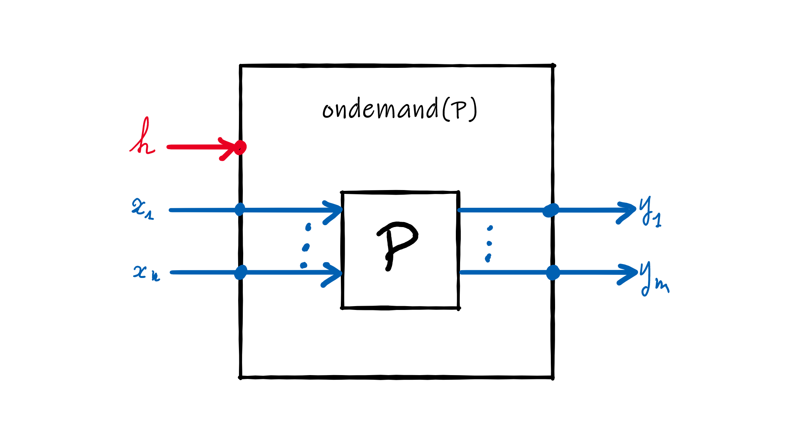
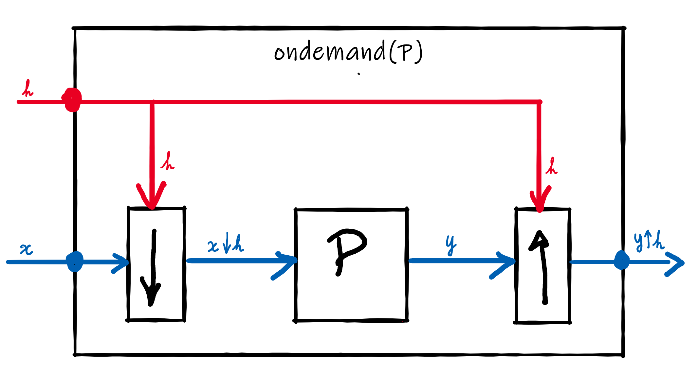

# _On-demand_ computations in Faust

**[YO, Preliminary draft v3]**

## Introduction

There are requests for using Faust in a more _composition-oriented_ way. For that purpose, it has been suggested to introduce _on-demand_ computations. In this model, computations are not performed on a sample-by-sample basis, as is normally the case with Faust, but only on request. Conceptually, these requests are propagated backwards, starting from the output of the expression and going back to the inputs.

The challenge is to introduce _on-demand_ computations while keeping the simple and well-defined _signal processor_ semantics of Faust. In this note we propose a new $\mathtt{ondemand}(P)\rightarrow P'$ primitive that transforms a signal processor $P$ into an _on-demand_ signal processor $P'$, and we define its semantics. As we will see, this semantics can be expressed using the regular Faust semantics, but applied to _downsampled_ signals.

## Semantics of Faust Expressions

Before describing the particular semantics of $\mathtt{ondemand}()$, let's take a look at the semantics of Faust in general. Faust semantics is based on _signals_ and _signal processors_. A _signal_ is a function of time and a _signal processor_ is a function of signals. A Faust program describes a _signal processor and programming in Faust is essentially combining _signal processors_ together, for example using composition operators like $\mathtt{:}$ or $\mathtt{\sim}$. 

### Time

Time in Faust is discrete and it is represented by $\mathbb{Z}$. All computations start at time $0$, but negative $times are possible in order to take delay operations into account .

### Signals

A _signal_ $s$ is a function of time $s:\mathbb{Z}\rightarrow\mathbb{R}$. Actually Faust considers two types of signals: _integer signals_ ($s:\mathbb{Z}\rightarrow\mathbb{Z}$) and _floating point signals_ ($s:\mathbb{Z}\rightarrow\mathbb{Q}$) but this distinction doesn't matter here. The value of a signal $s$ at time $t$ is written $s(t)$. 

The set of all possible signals in Faust is $\mathbb{S}\subset\mathbb{Z}\rightarrow\mathbb{R}$. The set $\mathbb{S}$  is a subset of $\mathbb{Z}\rightarrow\mathbb{R}$ because the value of any Faust signal $s$ at a negative time is always $0$: $\forall s\in\mathbb{S},s(t<0)=0$. In operational terms this corresponds to initialising all delay lines with $0$s.

### Tuples

A group of $n$ signals (a $n$-tuple of signals) is written $(s_{1},\ldots,s_{n})\in \mathbb{S}^{n}$. The *empty tuple*, single element of $\mathbb{S}^{0}$ is notated  $()$.

### Signal Processors

A *signal processors* $P:\mathbb{S}^{n}\rightarrow\mathbb{S}^{m}$, is a function that maps a $n$-tuple of signals to a $m$-tuple of signals . The set $\mathbb{P}=\bigcup_{n,m}\mathbb{S}^{n}\rightarrow\mathbb{S}^{m}$ is the set of all possible signal processors.

### Composition operators

The five composition operators of Faust ($<: \ :\ :>\ ,\ \sim$) are all binary operations on signal processors: $\mathbb{P}\times\mathbb{P}\rightarrow\mathbb{P}$.

### Semantic Brackets

In order to distinguish a Faust expression from its _meaning_ as a signal processor, we use the semantic brackets notation $[\![\ ]\!]$. For example $[\![+]\!]$ represents the *meaning* of Faust expression $+$ , a signal processor with the following type and definition: 
$$
\begin{align}
	[\![+]\!]&: \mathbb{S}^2\rightarrow\mathbb{S}^1 \\
[\![+]\!](x,y) &= \lambda t.(x(t)+y(t))	
\end{align}
$$
Numbers are also signal processors. The *meaning* of the Faust expression $1$ is the following: 

$$
\begin{align}
	[\![1]\!]&: \mathbb{S}^0\rightarrow\mathbb{S}^1 \\
[\![1]\!]() &= \lambda t.\left\{ \begin{array}{lr}
                0  &(t < 0)\\
                1  &(t \ge 0)
              \end{array}\right.

\end{align}
$$

## The $\mathtt{ondemand}(P)$ primitive

The vast majority of Faust primitives, like $+$ or $\mathtt{enable}$, are operations on *signals*. The $\mathtt{ondemand}$ primitive is very different. It is an operation on *signal processors* of type $\mathbb{P}\rightarrow\mathbb{P}$. It transforms a signal processor $P$ into an on-demand version, as illustrated in the figure below:

If $P$ has $n$ inputs and $m$ outputs, then $\mathtt{ondemand}(P)$ has $n+1$ inputs and $m$ outputs. The additional input of $\mathtt{ondemand}(P)$ is a clock signal $h$ that indicates by a $1$ when there is a computation demand, and by $0$ otherwise. In other words, $h(t)=1$ means that there is a computation demand at time $t$.
$$
\frac{P:n\rightarrow m}{\mathtt{ondemand}(P):1+n\rightarrow m}
$$

### The clock signal $h$

From a clock signal $h$ we can derive a signal $h^*$ that indicates the time of each demand. For example if $h=1,0,0,1,0,0,0,1,0\ldots$ then $h^*=0,3,7,\ldots$ indicating that the first demand is at time $0$, the second one at time $3$, the third one at time $7$, etc. We have 
$$
\begin{split}
h^*(0) &= \min \{t'|(h(t')=1)\} \\
h^*(t) &= \min \{t'|(h(t')=1) \and (t'>h^*(t-1))\}
\end{split}
$$

We also derive another signal $h^+$ that _counts_ the number of demands:
$$
h^+(t) = \sum_{i=0}^t h(i)
$$
For the same $h=1,0,0,1,0,0,0,1,0\ldots$ we have $h^+=1,1,1,2,2,2,2,3,3,\ldots$

Now that we have defined the clocks signals $h$ and $h^*$, we can introduce the _downsampling_ and _upsampling_  operations needed to express the _on-demand_ semantics. 

### Downsampling

The downsamplig operation is notated $\downarrow h$. For a signal $x$, the downsampled signal $x\downarrow h$ is defined as:
$$
x\downarrow h = \lambda t.x(h^*(t))
$$
For example if $x=0.0, -0.1, -0.2, -0.3, -0.4, -0.5, -0.6, -0.7,\ldots$ and  $h^*=0,3,7,\ldots$, then $x\downarrow h = 0.0,-0.3,-0.7,\ldots$ 

### Upsampling

The reverse _upsampling_ operation, notated $\uparrow h$, expands the input signal by repeating the missing values. 
$$
x\uparrow h = \lambda t.x(h^+(t)-1)
$$

For example if $ x = 0.0,-0.3,-0.7,\ldots$  and $h^+=1,1,1,2,2,2,2,3,3,\ldots$ then $x \uparrow h = 0.0,0.0,0.0,-0.3,-0.3,-0.3,-0.3,-0.7,\ldots$ 

> _NOTE_: please note that $\uparrow h:\downarrow h$ is the identity function, but that is not true for $\downarrow h:\uparrow h$.

### Semantics of $\mathtt{ondemand}(P)$

We now have all the elements to define the semantics of $\mathtt{ondemand}(P)$. Let's $P$ be a signal processor with $n$ inputs and $m$ outputs.  The semantics of $\mathtt{ondemand}(P)$ is defined by the following rule:
$$
\frac{[\![P]\!](x_1\downarrow h,\ldots,x_n\downarrow h)=(y_1,\ldots,y_m)}
{[\![\mathtt{ondemand}(P)]\!](h, x_1,\ldots,x_n)= (y_1 \uparrow h,\ldots,y_m\uparrow h)}
$$

As we can see, $[\![\mathtt{ondemand}(P)]\!]$ is basically $[\![P]\!]$ applied to downsampled versions of the input signals: $x_i\downarrow h$. The downsampling depends on the demand clock $h$. Intuitively this corresponds to the fact that the values of the input signals are lost between two computation demands. Symmetrically the $y_i$ signals returned by P have to be upsampled: $y_i\uparrow h$. This is illustrated by the following block-diagram

## Combining on-demands

What happens when we combine on-demands ? Can we factorize on-demands ? For example, is the sequencial composition of two on-demands with the same clock equivalent to the on-demand of the sequential composition of the inner processors ? We need to be able to answer these questions in order to normalize Faust expressions and generate the most efficient code.

### Notation

Lets start by defining some additional notation. Instead of writing the on-demand version of $P$ controlled by clock $h$ as the partial application: $\mathtt{ondemand}(P)(h)$, we will simply write $P\downarrow h$. 

Let's also notate $1_h=1,1,1,\ldots$ the clock signal that contains only 1s, that is a demand every tick, and $0_h=0,0,0,\ldots$ the clock signal that contains only 0s and therefore no computation demands at all. 

### Combining Clocks

We are interested in understanding what happens when we write something like: $(P\downarrow h_0)\downarrow h_1)$. There is, of course, an equivalent clock $h_3$ such that $(P\downarrow h_0)\downarrow h_1) = P\downarrow h_3$. But how do we compute it? 

Let's call $\otimes$ the operation that combines two clock signals and such that:
$$
(P\downarrow h_0)\downarrow h_1) = P\downarrow(h_0\otimes h_1)
$$
Let's see what the properties of $\otimes$ are.

### Identities

There are two remarkable identities, related to the $1_h$ and $0_h$ clocks, that need to be taken into account:
$$
\begin{align}
(P\downarrow 1_h)\downarrow h) &= P\downarrow h = (P\downarrow h)\downarrow 1_h)\\
(P\downarrow 0_h)\downarrow h) &= P\downarrow 0_h = (P\downarrow h)\downarrow 0_h)
\end{align}
$$
We therefore deduce that:
$$
\begin{align}
1_h\otimes h &= h\otimes 1_h = h\\
0_h\otimes h &= h\otimes 0_h = 0_h
\end{align}
$$
That brings us to a new question: is $\otimes$ a commutative operation?
$$
h_1\otimes h_0 = h_0\otimes h_1
$$

  ### Manual Computation

Let's first manually compute the demands for  $(P\downarrow h_0)\downarrow h_1)$ with 
$$
\begin{split}
h_0             &=1,0,1,0,1,0,1,0,1,0,\ldots\\
h_1             &=1,1,0,1,0,0,1,0,0,0,\ldots\\
tick	&=0,1,2,3,4,5,6,7,8,9,\ldots
\end{split}
$$
- at tick $0$ we have a demand because $h_1(0)=1$ and $h_0(0)=1$ ; 
- at tick 1 we have no demand because $h_1(1)=1$, but $h_0(1)=0$; 
- at tick 2 we have no demand because $h_1(2)=0$, moreover no demand is propagated to $h_0$; 
- at tick 3 we have a demand because $h_1(3)=1$ and $h_0(2)=1$;
- etc.

$$
\begin{split}
h_0             &=1,0,1,0,1,0,1,0,1,0,\ldots\\
h_1             &=1,1,0,1,0,0,1,0,0,0,\ldots\\
tick	&=0,1,2,3,4,5,6,7,8,9,\ldots\\
h_0\otimes h_1         &=1,0,0,1,0,0,0,0,0,0,\ldots\\
\end{split}
$$

### General Rule

The property to observe from this manual example that one does not necessarily progress to all ticks in $h_0$. In reality, we only progress in $h_0$ when there are requests in $h_1$. In other words, when we are at the tick $t$ in $h_1$ we are only at the tick $h_1^+(t)-1$ in $h_0$. Furthermore, for a request to reach $P$ it is necessary to have $h_1(t)$ and $h_0(h_1^+(t)-1)$ at $1$. We can now write down the general rule:
$$
(h_0\otimes h_1)(t)=h_1(t)*h_0(h_1^+(t)-1)
$$
It turns out that we've already met part of this formula with our upsampling function. So we can rewrite our definition as follows:
$$
(h_0\otimes h_1)=h_1*(h_0\uparrow h_1)
​					
$$

If we had chosen a more traditional upsampling function (without repetition, but with insertion of 0) we would have had simply: $\otimes=\uparrow$.

### Commutativity

Let's test commutativity and manually compute $h_1\otimes h_0$:
$$
\begin{split}
h_1   									&=1,1,0,1,0,0,1,0,0,0,\ldots\\
h_0   									&=1,0,1,0,1,0,1,0,1,0,\ldots\\
tick										&=0,1,2,3,4,5,6,7,8,9,\ldots\\
h_1\otimes h_0         	&=1,0,1,0,0,0,1,0,0,0\ldots\\
\end{split}
$$
As we see $h_1\otimes h_0 \neq h_0 \otimes h_1$, the operation is not commutative and therefore:
$$
(P\downarrow h_0)\downarrow h_1 \neq (P\downarrow h_1)\downarrow h_0
$$

### Associativity

Another interesting property is to check is associativity. Do we have:
$$
((h_0\otimes h_1)\otimes h_2)=(h_0\otimes (h_1\otimes h_2))
$$
